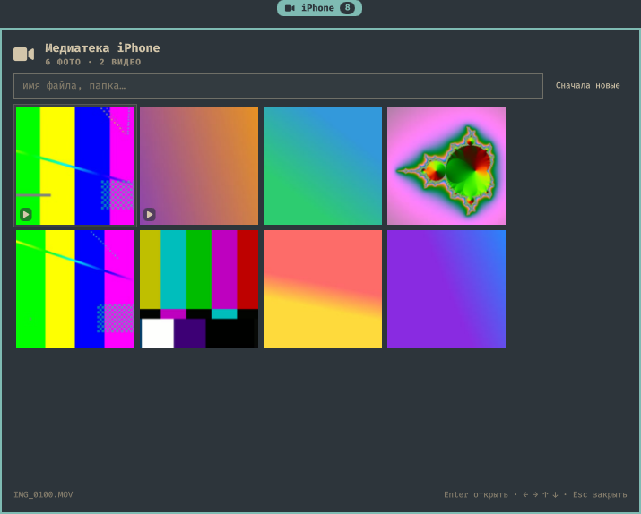
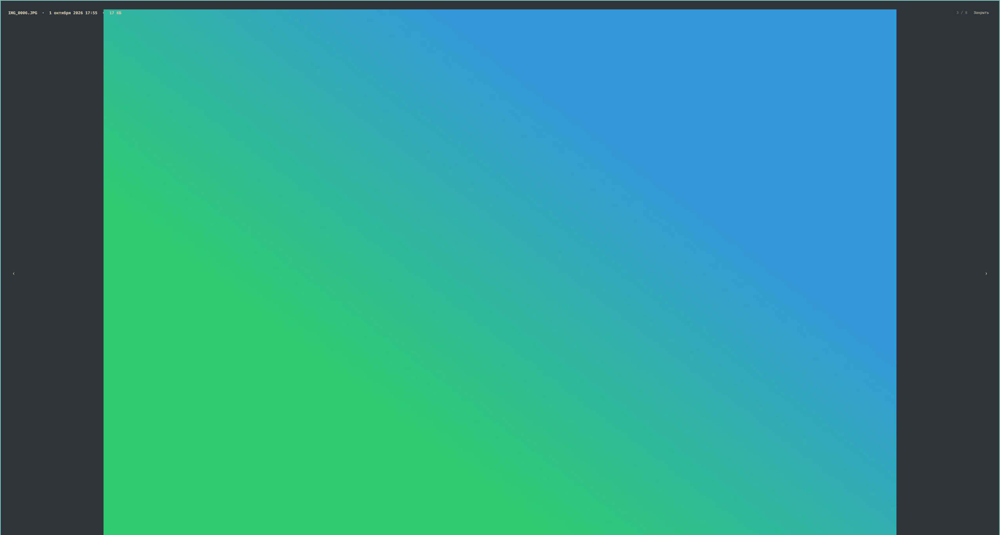

# Omaimediateka

> A **read-only** photo and video gallery for [Omarchy](https://omarchy.org/) Shell
> (Quickshell): browse `DCIM` from a USB-connected iPhone in a bar popup — no import,
> no deletion, no cloud.

[Русская версия →](README.ru.md)



The widget is one pill in the center of the Omarchy bar. Clicking it opens a popup
with a lazy-loaded preview grid of every photo and video under `DCIM`, a live filter,
and a fullscreen viewer. Access is local and read-only: the phone is mounted by
`gvfs-afc` over the USB cable and unmounted automatically when it is unplugged.

## Features

- **Bar pill** `iPhone · N` — number of media files found.
- **Preview grid** over every `DCIM` subfolder (`100APPLE`, `101APPLE`, …).
- **Lazy thumbnails** — generated on demand for visible cells, one decode at a time,
  cached on disk and invalidated by size/mtime.
- **Fullscreen viewer** — photos fit the screen; videos play inline through
  QtMultimedia. `←/→` navigates, metadata (name, date, size, duration) is shown.
- **Live filter** by file name or folder, and newest-/oldest-first sorting.
- **Clear states** instead of a blank screen: phone not connected, not trusted,
  `gvfs-afc` missing, no `DCIM`, mounting in progress.



## Requirements

- **Omarchy** with the Quickshell shell plugins API (tested with Omarchy 4.0.x,
  Quickshell 0.3.1).
- **`gvfs-afc`** — the AFC backend that exposes the iPhone as files.
- **`libimobiledevice`, `libusbmuxd`, `usbmuxd`** — device detection and pairing.
- **`libheif`** (`heif-convert`) — required for HEIC photos. System `ffmpeg` is built
  without a HEIF demuxer and Qt's imageformats has no HEIC plugin, so HEIC stills are
  converted with `heif-convert` before thumbnailing.
- **`ffmpeg` / `ffprobe`** — JPEG/PNG/WebP thumbnails, video posters and duration.
- **`qt6-multimedia-ffmpeg`** (optional) — in-widget video playback.

On Arch:

```bash
sudo pacman -S gvfs-afc libimobiledevice usbmuxd libheif ffmpeg qt6-multimedia-ffmpeg
```

## System setup (one time)

```bash
sudo pacman -S gvfs-afc
sudo systemctl start usbmuxd     # usually started automatically by udev on plug-in
```

Then connect the iPhone, unlock it, and tap **Trust** on the phone.

Sanity check:

```bash
idevice_id -l                          # prints the device UDID
idevicepair -u <UDID> validate         # SUCCESS: Validated pairing
ls "$XDG_RUNTIME_DIR"/gvfs/afc:host=*  # DCIM/ appears
```

The widget never runs `sudo`: mounting is handled by the user session via gvfs.

## Install

```bash
git clone https://github.com/salehardec/omaimediateka.git
cd omaimediateka
./install.sh
```

`install.sh` copies the plugin into `~/.config/omarchy/plugins/omaimediateka/`
(the directory comes from the `id` in `manifest.json`).

Enable the widget by adding it to the center section of `~/.config/omarchy/shell.json`:

```json
{
  "bar": {
    "layout": {
      "center": [
        { "id": "omaimediateka" }
      ]
    }
  }
}
```

Then restart the shell:

```bash
omarchy restart shell
```

Uninstall with `./install.sh --uninstall`.

## Usage

| Action | Key / control |
|---|---|
| Open / close popup | click the bar pill |
| Move in the grid | `← → ↑ ↓` or `hjkl` |
| Open fullscreen | `Enter`, `Space`, or click |
| Filter | start typing; `Esc` in the field clears it |
| Sort | the “newest / oldest first” button |
| Previous / next in viewer | `← →` or the side buttons |
| Video play / pause | `p`, `Space`, or the button |
| Back to grid | `Esc` |
| Close popup | `Esc` (from the grid) |

## How it works

- **Access** — `gio mount afc://<UDID>/` mounts the phone through `gvfs-afc`; the
  files are then readable at `$XDG_RUNTIME_DIR/gvfs/afc:host=<UDID>/`. Unplugging
  the cable removes the path, and the widget falls back to “not connected”.
- **`bin/oma-mediateka`** is the only component that knows about the backend:
  - `status` — detects device, trust, and mount (one JSON line);
  - `list <dcim>` — a single `find` pass over media files (TSV);
  - `thumb <src> <dst> <kind> [thumb|preview]` — renders a JPEG preview into the cache;
  - `meta <src>` — video duration and dimensions.
- **Cache** — `~/.cache/omaimediateka/thumbs/` and `.../previews/`. Keys include the
  file size and mtime, so changed files are re-rendered and unchanged ones are reused.
- **Sorting** — by Apple’s file numbering (folder + number), which is chronological
  even when gvfs `mtime` is unreliable, with mtime as a tie-breaker.

Design notes (in Russian): [`docs/superpowers/specs/2026-10-01-iphone-media-plugin-design.md`](docs/superpowers/specs/2026-10-01-iphone-media-plugin-design.md).

## Limitations

- **Read-only.** The widget never imports, copies, or deletes anything.
- The **interface is currently in Russian**; the code and this README are in English.
  Localization PRs are welcome.
- Sorting follows Apple’s file numbering, **not EXIF capture date**.
- **Live Photos** show up as two separate items (a HEIC and a MOV).
- One iPhone at a time; the first detected device wins.
- `ifuse` is not used. The backend is isolated in `bin/oma-mediateka`, so adding it
  later would not touch the QML.

## Development

```bash
node test/MediaModel.test.js   # pure model: listing, sorting, filtering, cache keys
bash -n bin/oma-mediateka      # helper syntax
./bin/oma-mediateka status     # with no phone: state=no-device
```

Repository layout:

```
manifest.json      # id, kinds: bar-widget, entryPoints.barWidget
Panel.qml          # bar pill + popup: grid, filter, fullscreen viewer
VideoView.qml      # QtMultimedia player, imported in isolation
MediaModel.js      # pure, node-testable model
bin/oma-mediateka  # status | list | thumb | meta
install.sh         # install / uninstall
test/              # node tests for the model
docs/              # design spec and screenshots
```

## License

MIT — see [LICENSE](LICENSE).
